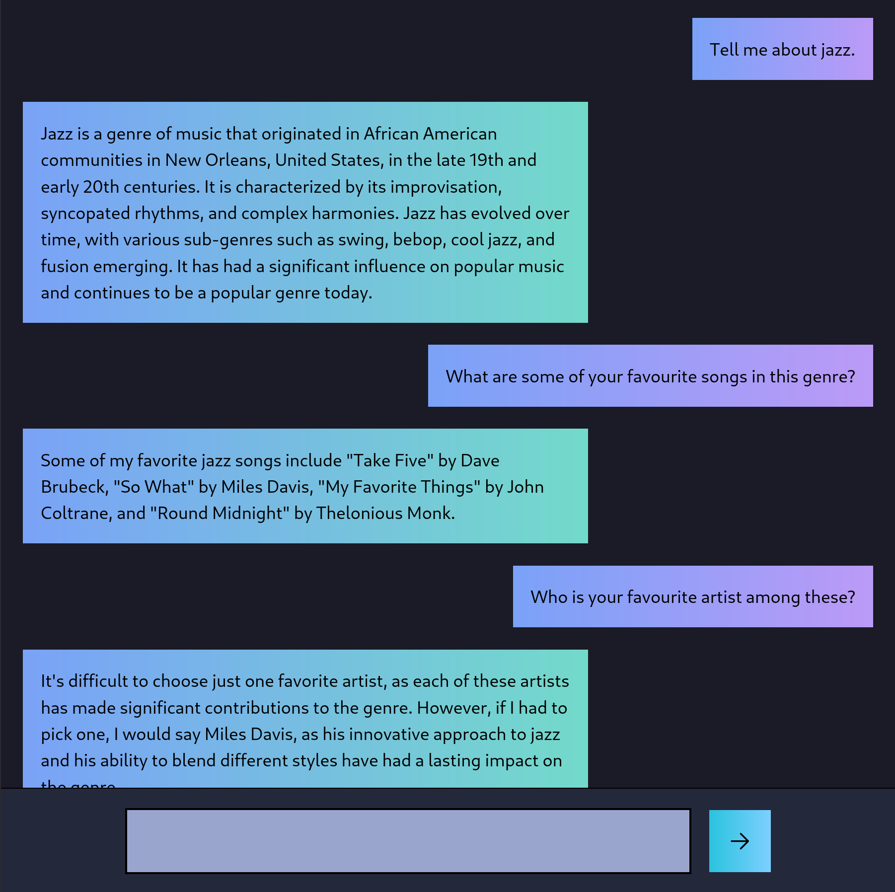
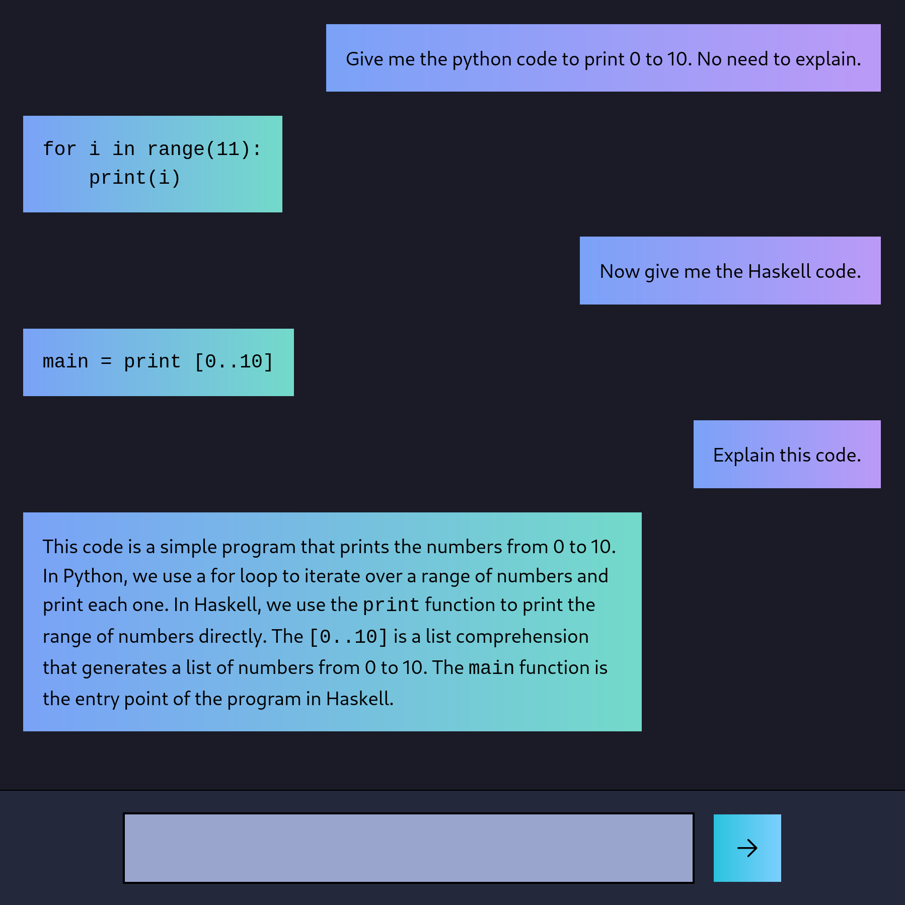

## CandleMist

<div "align: center;">
    
    &nbsp; &nbsp;
    
</div>

- A simple chatbot built using Rust, in the frontend and the backend.
- Made using `candle`, `leptos`, `actix`, `tokio` and TailwindCSS.
- Uses quantized Mistral 7B Instruct v0.1 GGUF models.

  #### Credits

  - This is a fork of [MoonKraken/rusty_llama](https://github.com/MoonKraken/rusty_llama) by [Code to the Moon](https://www.youtube.com/watch?v=vAjle3c9Xqc).
  - This chatbot uses Mistral GGUF models and the [`huggingface/candle`](https://github.com/huggingface/candle) framework, which includes the `candle-transformers` crate, whereas the original uses GGML models and the [`rustformers/llm`](https://github.com/rustformers/llm) crate.
  - The frontend has some aesthetic changes, but the overall structure is the same.
  - Colours are from the Tokyo Night colorscheme.

## Setup Instructions

### Rust Toolchain

You'll need to use the nightly Rust toolchain, and install the `wasm32-unknown-unknown` target as well as the `trunk` and `cargo-leptos` tools:

```
rustup toolchain install nightly
rustup target add wasm32-unknown-unknown
cargo install trunk cargo-leptos
```

### Hardware

- For CUDA, add the `cuda` feature for candle_core in Cargo.toml.
```
candle-core = { git = "https://github.com/huggingface/candle.git", version = "0.6.0", optional = true, features = ["cuda"] }
```
- For Metal, add the `metal` feature for candle_core in Cargo.toml.
- For Intel's oneAPI Math Kernel Library, add the `mkl` feature for candle_core in Cargo.toml.
- For Accelerate, add the `accelerate` feature for candle_core in Cargo.toml.

### Model

- Download any Mistral 7B Instruct v0.1 GGUF model and set the environment variable `MODEL_PATH` in `.env`.

  #### Tested Models

  - [mistral-7b-instruct-v0.1.Q4_K_M.gguf](https://huggingface.co/TheBloke/Mistral-7B-Instruct-v0.1-GGUF/tree/main)
  - [dolphin-2.6-mistral-7b.Q4_K_M.gguf](https://huggingface.co/TheBloke/dolphin-2.6-mistral-7B-GGUF/tree/main)

- Download tokenizer.json and set the environment variable in `TOKENIZER_PATH` in `.env`.

  #### Tokenizer

  - [Mistral-7B-v0.1/tokenizer.json](https://huggingface.co/mistralai/Mistral-7B-v0.1/blob/main/tokenizer.json)

### TailwindCSS

- Install TailwindCSS with `npm install -D tailwindcss`.

### Run

1.

```
git clone https://github.com/ShettySach/CandleMist.git
cd CandleMist
```

2.

```
npx tailwindcss -i ./input.css -o ./style/output.css
```

3.

```
cargo leptos serve --release
```

4. In your browser, navigate to [http://localhost:3000/?](http://localhost:3000/?)

##### NOTE -

- You can modify parameters such as temperature, seed, top-k, top-p, max history and max response length, and also modify the chat template in 'src/api.rs'.
